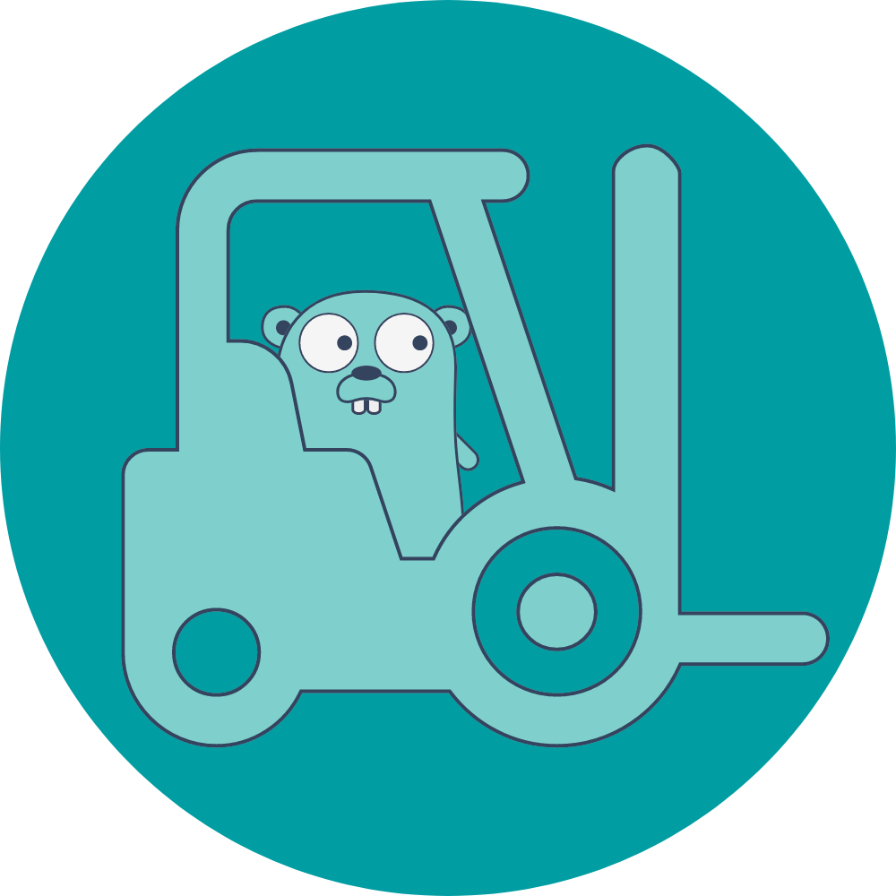

  
  <h3 align="center">GLoader</h3>
  
Migrate data from any source to any destination in a single command!

---

# Note: Under development :construction:

# GLoader
Migrate data from any source to any destination in a single command!

# Glossary
- **Source**: The source of the data to be migrated.
- **Destination**: The destination of the data to be migrated.
- **Data**: The Data is a pair of key, value and DataType. Data is the unit of information that is migrated from the source to the destination. also, data is the smallest unit of information in GLoader.
- **DataType**: The type of the data can be used in the migration process. For example, the data can be a string, a number, a boolean, a date, a json, etc.
- **DataSet**: A collection of data that is migrated from the source to the destination. is equivalent to a row in a relational database.
- **DataBatch**: A batch of DataSet that is migrated from the source to the destination. is equivalent to a table in a relational database.
- **Migration**: The process of migrating data from the source to the destination.